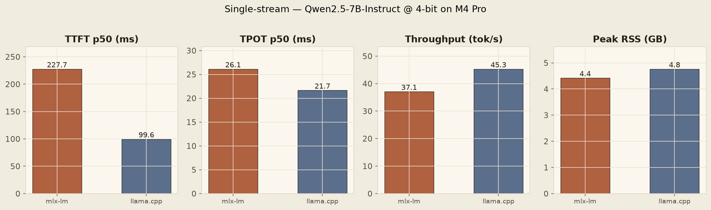
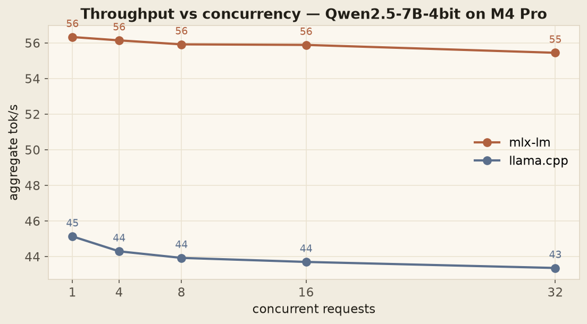
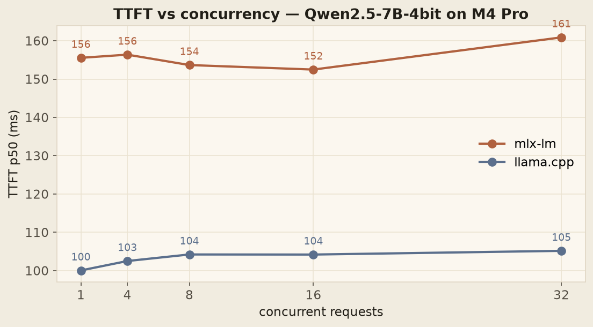
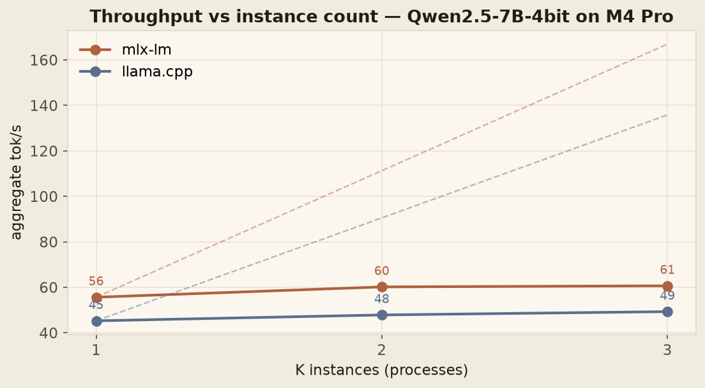

# MLX vs llama.cpp on Apple Silicon: a fair LLM-serving benchmark

**TL;DR** — On an M4 Pro MacBook Pro, both `mlx-lm` and `llama.cpp` serve
Qwen2.5-7B-Instruct at 4-bit at 45–56 tokens per second single-stream.
Fast enough for real interactive use. But the moment a second request
arrives concurrently, throughput flatlines. Neither engine can
parallelize a single model instance on Apple Silicon — and that's the
actually interesting story.

---

## The question

I do ML engineering on a MacBook Pro M4 for everything except heavy
training. With the recent wave of high-quality 7B-class open LLMs
(Qwen2.5, Qwen3, Llama 3.1), I wanted a real answer to a question that
comes up in every "should we self-host?" conversation:

> *Can a modern MacBook Pro usefully serve a 7B LLM, and at what
> concurrency does it stop being useful?*

"Usefully" means: fast enough that an interactive chat client doesn't
feel laggy, and stable enough under load that you could actually put it
behind an API.

There are two engines that matter on Apple Silicon today:

- **`mlx-lm`** — Apple's own framework, built for unified memory on
  M-series chips.
- **`llama.cpp`** — the cross-platform baseline, with a mature Metal
  backend.

Most existing benchmarks compare them on different hardware, with
different models, at different quantization levels, or using synthetic
workloads. I wanted the same model, same prompts, same hardware, same
workload contract — a fair fight.

## The setup

- **Hardware:** MacBook Pro, M4 Pro, macOS
- **Model:** `Qwen2.5-7B-Instruct`, 4-bit quantization
  - mlx format: `mlx-community/Qwen2.5-7B-Instruct-4bit`
  - GGUF format: `bartowski/Qwen2.5-7B-Instruct-GGUF` (Q4_K_M)
- **Workload:** 12 prompts of varying length (5 short, 5 medium, 2 long),
  greedy decode (`temperature=0`), `max_tokens=256`, no system prompt.
- **Measurement:** 3 warmup requests, then 20 measured (single-stream)
  or 16 measured per concurrency level (sweep). p50 reported as headline;
  p99 captured but not over-interpreted on n=20.
- **Metrics:**
  - **TTFT** — wall-clock from request submission to first non-empty token.
  - **TPOT** — decode-phase time per output token.
  - **Aggregate throughput** — `sum(output_tokens) / wall_seconds`.
  - **Peak RSS** — peak resident memory.

Full fairness contract: [`methodology.md`](methodology.md).

## Single-stream — the headline numbers



| Engine    | TTFT p50 | TPOT p50 | tok/s | RSS GB |
|-----------|---------:|---------:|------:|-------:|
| mlx-lm    |   228 ms | 26.1 ms  |  37.1 |  4.42  |
| llama.cpp |   100 ms | 21.7 ms  |  45.3 |  4.76  |

At first glance this looks like a llama.cpp win. But the mlx-lm
throughput number is misleading: those numbers were captured on cold
Metal kernels. After warmup (which the concurrency sweep does naturally),
mlx-lm settles at ~56 tok/s. The warmer numbers are the more honest
baseline.

Even with that correction, **llama.cpp wins on TTFT by a wide margin —
100 ms vs 228 ms.** For interactive chat, that's the difference between
"the model started typing instantly" and "the model took a noticeable
beat to start."

## The concurrency surprise

Here's where it gets interesting. I ran the same workload at offered
concurrency of 1, 4, 8, 16, and 32 — firing N requests in parallel via
Python's `ThreadPoolExecutor` and measuring aggregate throughput.



The line is flat. For both engines.

Going from one user to thirty-two concurrent users, aggregate throughput
stays within ±4%. You're not getting any more tokens out of the device
by offering it more work. It's saturated at one user.

Why? Because **a single LLM model instance is one piece of state, and
you can't safely touch it from two threads.** Both `mlx-lm` and
`llama.cpp` crash if you try — segfault in llama.cpp, trace trap (Metal
dispatch corruption) in mlx. The fix is a per-instance lock, and once
you add it, requests serialize through the lock. Throughput is constant;
queue depth grows; latency degrades linearly with concurrency.



Notice the TTFT lines also stay roughly flat. That's a clue about what's
*not* happening: the requests aren't really queueing visibly at these
levels, because the ThreadPoolExecutor with 16–32 workers absorbs the
parallelism at the Python layer. The queue forms *inside* the lock, but
each request still completes in ~5 seconds, so by the time the next one
acquires the lock, the previous has finished. With longer requests or
higher concurrency, you'd see TTFT climb linearly.

This isn't a bug in either engine. It's a fundamental property:
**single-instance serving on a single device cannot parallelize.**

The standard answer to this in production LLM serving is **continuous
batching** — a technique where the engine itself manages a request queue
and *batches tokens from different requests into a single forward pass*,
so multiple users share the compute. This is what `vLLM`, `SGLang`,
`TensorRT-LLM`, and `TGI` all do. None of them run on Apple Silicon
today.

So on a MacBook Pro, you cannot beat single-stream throughput by adding
concurrency unless you either:

1. Run K separate model instances (K × ~5 GB RAM, K × the device).
2. Wait for someone to ship continuous batching for Metal.

For a laptop with 32–48 GB unified memory, option (1) caps out around
K=4–6 instances. That's the real ceiling.

## Part 2 — we built the dispatcher, and the ceiling is lower than that

*Update: we've since built and measured option (1). The result reframes
everything above — read on.*

`bench.py dispatch` runs a pool of K process-isolated engine instances
draining one shared request queue — the honest implementation of "run K
separate instances." Each instance gets its own process (threads would
understate capacity: the per-instance lock and GIL contention are both
artifacts we're trying to remove), its own warmup, and the same 12-prompt
workload contract. Measured at K = 1, 2, 3 on 24 GB of unified memory
(each 4-bit instance costs ~4.3–4.8 GB).



| Engine    | agg tok/s @ K=1 | @ K=2      | @ K=3      | TPOT per stream   |
|-----------|----------------:|-----------:|-----------:|-------------------|
| mlx-lm    | 55.6            | 60.2 (+8%) | 60.7 (+9%) | 17 → 32 → 48 ms   |
| llama.cpp | 45.3            | 47.8 (+6%) | 49.3 (+9%) | 22 → 41 → 60 ms   |

Three times the memory buys single-digit throughput. And the TPOT column
is the tell: each individual stream's decode rate degrades almost
perfectly linearly with K. The instances aren't adding capacity —
they're dividing the same saturated resource among more users.

The arithmetic explains why. A 4-bit 7B model is ~4.4 GB of weights, and
decode streams all of them for every token. At 56 tok/s that's ~250 GB/s
of the M4 Pro's ~273 GB/s unified-memory bandwidth. **The first instance
already saturates the bus**; the ~10% headroom is exactly what K=2 and
K=3 recover.

So the ceiling diagram on Apple Silicon has two layers:

1. The **lock ceiling** — one instance serializes every request
   (the concurrency sweep above).
2. The **bandwidth ceiling** — remove the lock with more instances, and
   the memory bus becomes the limit (this benchmark).

The only serving technique that beats layer 2 is continuous batching:
batched decode reads the weights *once per forward pass for the whole
batch*, cutting the bandwidth cost per token by the batch factor. That's
the actual reason vLLM, SGLang, and TensorRT-LLM exist — and why
"just run K instances" is not a substitute for any of them.

## mlx-lm vs llama.cpp — what they optimize

The most useful finding from this exercise isn't "which is faster."
It's that **they optimize different things.**

|                            | mlx-lm     | llama.cpp   |
|----------------------------|-----------:|------------:|
| TTFT (first-token latency) |     228 ms |  **100 ms** |
| Decode throughput          | **56 t/s** |      45 t/s |
| Memory                     |  **4.4 GB**|    4.8 GB   |
| Stable under concurrency   | crashes at conc≥8 without lock | segfaults immediately without lock |

- **mlx-lm wins decode throughput by ~24%.** Once the first token is
  out, mlx-lm produces subsequent tokens faster. Better for long-form
  generation, document summarization, batch workloads where TTFT is
  amortized.
- **llama.cpp wins TTFT by ~56%.** First token arrives in less than half
  the time. Better for interactive chat where users feel the latency of
  the first character appearing.
- **mlx-lm is slightly more memory-frugal** (4.4 vs 4.8 GB), which
  matters when you're fitting multiple instances into unified memory.

If you're building a coding assistant or a RAG pipeline where one
request = many tokens of output, pick mlx-lm. If you're building a chat
interface where users click "send" and wait, pick llama.cpp.

## What this means in practice

Three takeaways for anyone considering local LLM serving on Apple
Silicon:

1. **For single-user workloads, an M4 Pro is genuinely competitive with
   cloud APIs.** 45–56 tok/s on a 7B model is in the same ballpark as
   GPT-3.5-class APIs, with zero per-token cost, zero network latency,
   and full data privacy. If your workload fits one user at a time, your
   laptop is enough.

2. **For multi-user serving, you need different infrastructure.** A
   single MacBook Pro cannot serve multiple concurrent users faster than
   it serves one. If you need to handle a team of 10 engineers hitting
   the same model, you either need a small fleet of Macs (expensive
   fast) or a cloud GPU with a continuous-batching engine.

3. **Engine choice depends on workload shape, not "which is faster."**
   mlx-lm and llama.cpp are not interchangeable — they make different
   tradeoffs. Pick based on whether your workload cares about TTFT or
   decode rate more.

## What's next

This is Phase 1 of a larger project: a reproducible LLM-serving
benchmark across both Apple Silicon and cloud GPU, with the
cross-platform chart that tells you *exactly when local stops being
cheaper than cloud*.

Phase 2 rents a cloud H100 for a day and runs the same workload against
vLLM and TensorRT-LLM with continuous batching. The hypothesis: at
conc=32, an H100 should do ~10× the aggregate throughput of the M4 Pro.
The interesting number is the **cost-per-token crossover** — at what
concurrency does cloud GPU become cheaper than buying another MacBook?

## Reproduce

```bash
git clone https://github.com/anubhavagr/inference-lab
cd inference-lab
uv venv && source .venv/bin/activate
uv pip install mlx-lm llama-cpp-python matplotlib rich

# download the two model formats
hf download mlx-community/Qwen2.5-7B-Instruct-4bit --local-dir models/qwen25-7b-mlx-4bit
hf download bartowski/Qwen2.5-7B-Instruct-GGUF --include "*Q4_K_M*" --local-dir models/qwen25-7b-gguf-q4k

# single-stream
python bench.py mlx   models/qwen25-7b-mlx-4bit
python bench.py llama models/qwen25-7b-gguf-q4k/Qwen2.5-7B-Instruct-Q4_K_M.gguf

# concurrency sweep
python bench.py sweep mlx   models/qwen25-7b-mlx-4bit
python bench.py sweep llama models/qwen25-7b-gguf-q4k/Qwen2.5-7B-Instruct-Q4_K_M.gguf

# charts
python -m bench.plots
```

Numbers will vary ±5–10% based on macOS version, thermal state, and
background tasks. That's the reality of benchmarking on a laptop, not a
benchmarking rig.
